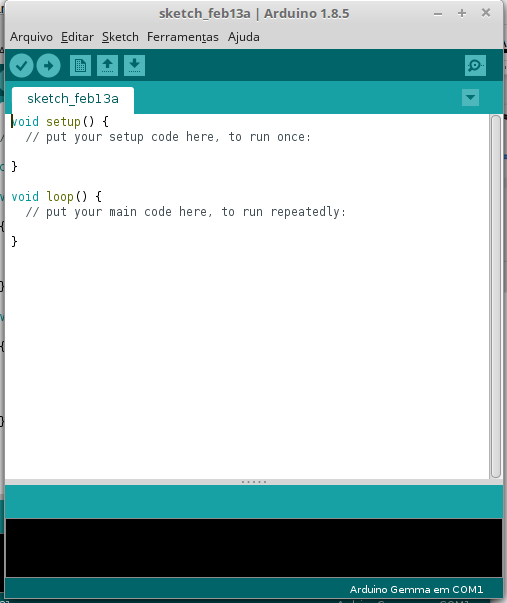
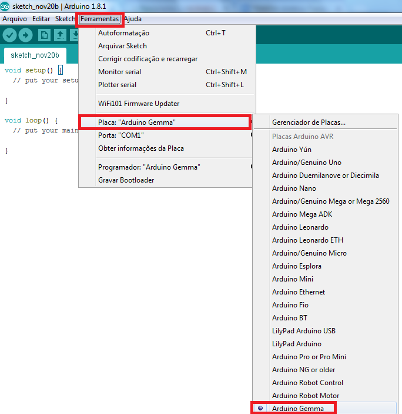
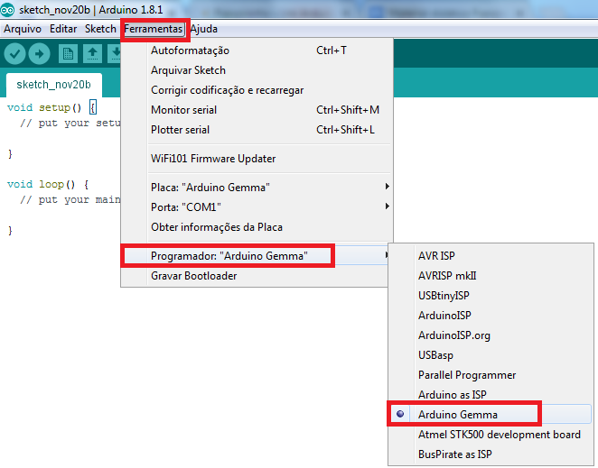

## Configuração da IDE Arduino para programar Gemma

Com a placa já montada e com o bootloader da Arduino Gemma já programado, o primeiro passo é configurar a IDE Arduino para uso da Franzininho.

Agora vamos até a barra superior e clique em Ferrentas>placa>Arduino Gemma:

Após isso é  necessário configurar o programador. Na barra de ferramentas, acesse Programador>Arduino Gemma:

Pronto a configuração da placa e programador para programação da Franzininho com o bootloader da Arduino Gemma está feita. Agora é só fazer o upload do seu sketch para a placa.
