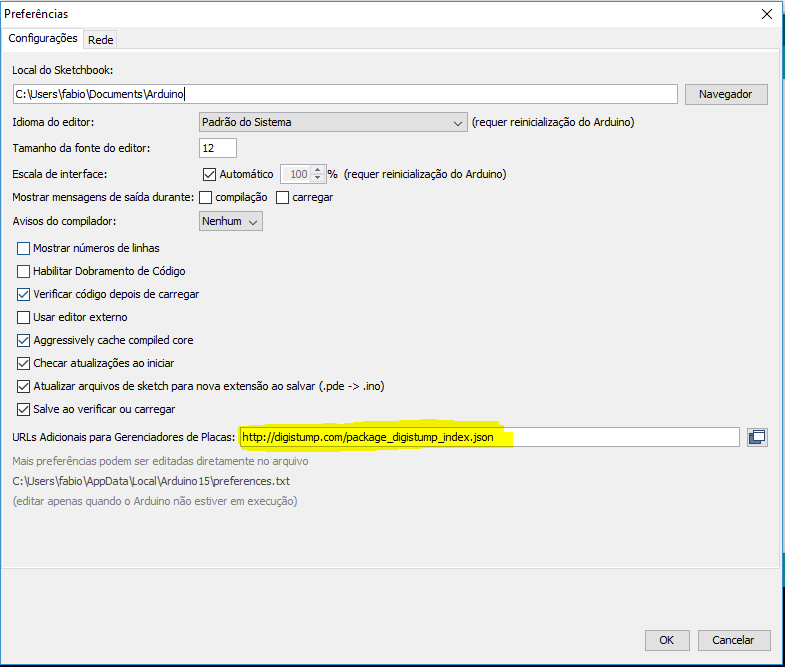
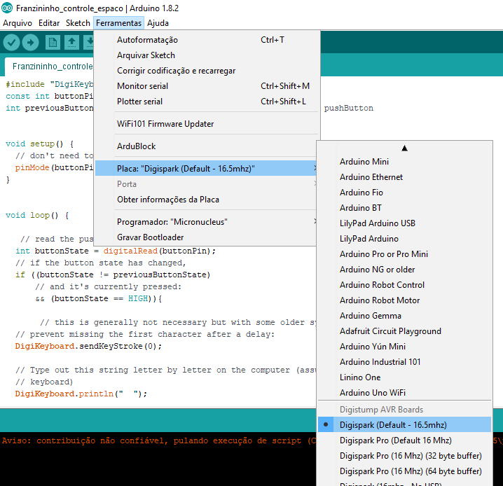
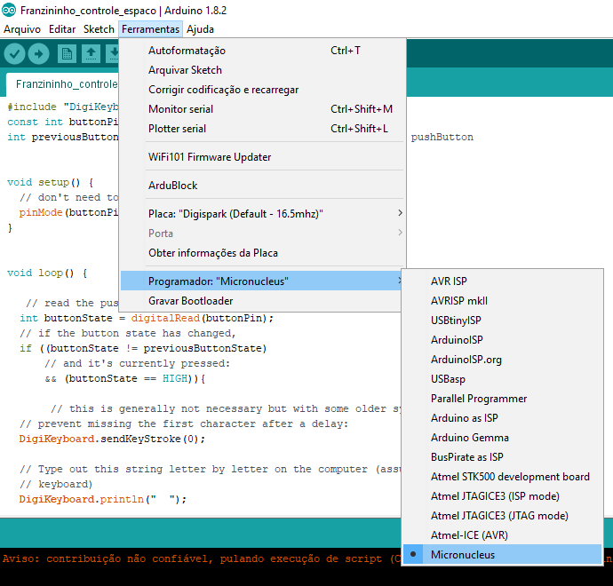

Com o microcnucleus gravado no Attiny85 você pode programar a franzininho usando o pacote de software desenvolvidos para a digispark. Para isso, você precisa instalar o pacote de suporte da Digispark na IDE Arduino (É necessário estar conectado a internet).

Acesse o menu Arquivos->preferencias e cole a URL a seguir para gerenciador de placas:

    http://digistump.com/package_digistump_index.json

Agora acesso o menu: Ferramentas-> placa -> Gerenciador de placas. Aguarde alguns segundos até atualização da lista de pacotes e digite "digi". Aparecerá o pacote “Digistump AVR Boards” e clique em instalar.

Aguarde o fim da instalação e clique em fechar.

Agora acesse o menu: Ferramentas->placas e escolha a opção “Digispark (Default - 16.5mhz)”.

Agora acesse o menu Ferramentas-> programador e selecione a opção Micronucleus:

Pronto a IDE está pronta para programar a placa.
