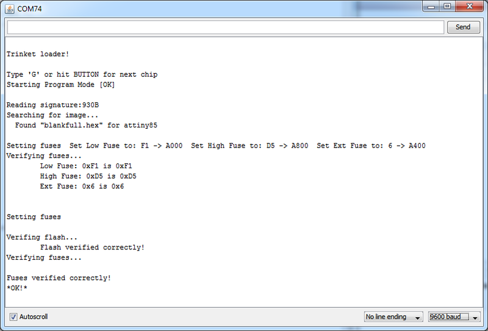

## Gravação do bootloader Gemma

A Arduino Gemma criada pela Adafruit, possui um bootloader próprio para o Attiny85. Você pode usar a Franzininho como uma Arduino Gemma gravando esse bootloader no Attiny85.

A seguir vamos apresentar o passo a passo para gravação do bootloader no Attiny85 e a configuração do divers em seu computador.

## Materiais Necessários

 - Arduino UNO
 - Fios (Jumpers)
 - Protoboard

## Circuito

Você precisará fazer a seguinte ligação do ATtiny85 no Arduino UNO:

## Preparando o Arduino UNO para programar o bootloader

A Adafruit disponibiliza um sketch para a [gravação do bootloader](https://learn.adafruit.com/introducing-trinket/repairing-bootloader) da Arduino Gemma e Trinket.

Para nosso tutorial, vamos usar uma versão traduzida pelo Mau Maker. Você pode acessar o projeto disponibilizado na [plataforma Arduino Create](https://create.arduino.cc/editor/maujabur/397f14ad-1fc1-49a5-b9a8-2143fda15b35/preview).

Você também pode baixar os arquivos que estão nesse repositório e gravar usando a IDE Arduino offline.

O primeiro passo é fazer o upload do código para a Arduino UNO.

Com as ligações feitas corretamente para a gravação do bootloader, abra o terminal serial, configure o baudrate para 9600 bps, e envie a letra G para iniciar a gravação. Será exibida a seguinte mensagem:

Pronto, agora é só inserir o microcontrolador na sua Franzininho.
