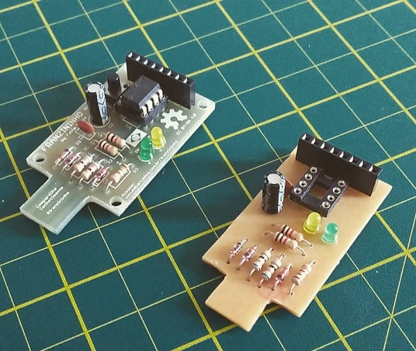
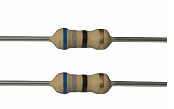

## Identificando os componentes

É importante identificar e separar os componentes antes da montagem da placa. A seguir serão apresentados todos os componentes da Franzininho com uma breve explicação sobre cada um.

### Placa de Circuito impressso

A placa de circuito impresso é responsável por receber todos os componentes. Ela pode ser feita de fibra de vidro ou fenolite. Para a Franzininho DIY foi desenvolvida um projeto em face simples, o que permite a fabricação caseira.

Na parte superior da placa(TOP) há os desenhos dos componentes, indicando a posição de cada um. O componentes são encaixados em seus respectivos locais e depois são soldados através da parte inferior(Bottom).

### Resistores

Os resistores são componentes passivos que se opoem a passagem de corrente elétrica no circuito. Existem diversos tipos de resistores na Franzininho usamos resistores de carbono de 1/4 W. Os anéis coloridos indicam o valor e tolerância do resistor.

Fonte: http://blog.render.com.br/eletronica/como-calcular-o-valor-de-um-resistor/

Na Franzininho usamos 5 resistores, com as seguintes referências e valores:

R1 e R2 - 68 R

R3 - 1K5

R4 e R5 - 1K

### Capacitores

Capacitores são dispositivos elétricos capazes de armazenar carga elétrica em um campo elétrico. Na Franzininho temos 2 tipos de capacitores:

C1 - Capacitor Cerâmico 100 nF x 50 V

C2 -capacitor eletrolítico 10uF x 35V

###  LEDS

LED (Light Emitting Diode), é usado para a emissão de luz em locais e instrumentos onde se torna mais conveniente a sua utilização no lugar de uma lâmpada.

Na Franzininho são usados dois leds difusos de 3 mm

ON - LED Verde
LED - LED Amarelo

###  Chave táctil

É um botão de contato momentâneo. Na Franzininho usamos uma chave táctil NA (normalmente aberta) de 4,3 x 6 x 6 mm que tem a função de botão de reset.

Chave - RESET

###  Soquete

Soquete é usado para o encaixe de circuitos integrados, facilitando a sua troca na placa.

Na Franzininho usamos um soquete de 8 pinos para acomodar o Microcontrolador attiny85

IC1 - Soquete

###  Barra de pinos

São usadas para expansão de pinos e entrada de alimentação na placa. Na Franzininho usamos 3 vias para o conector de alimentação e 8 vias para o conector de expansão da placa

- J1 - Barra de 3 pinos
- P0, P1...GND - Barra de 8 pinos

###  Regulador de Tensão

Usado para baixar a tensão de entrada para um nível que o circuito possa trabalhar. Na Franzininho usamos um regulador de tensão de 5V, o 78L05

IC2 - 78L05 - Regulador de tensão 5V

###  Conector USB

Usado para conectar a placa ao computador ou a um circuito de alimentação com conector USB. Na Franzininho usamos um Conector USB Macho 90º com trava

