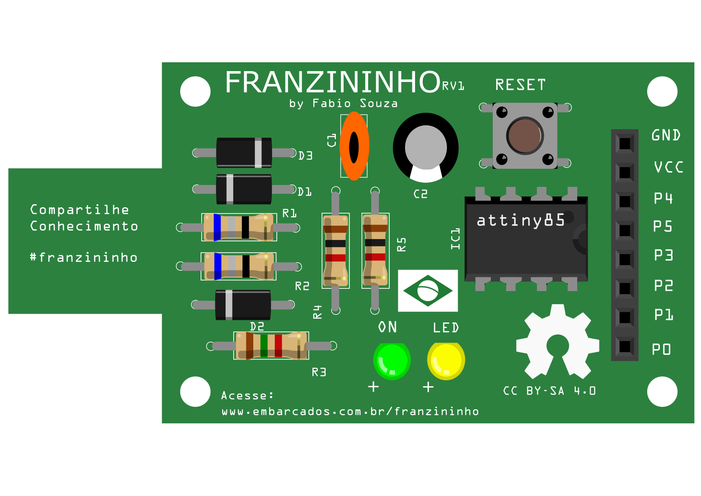
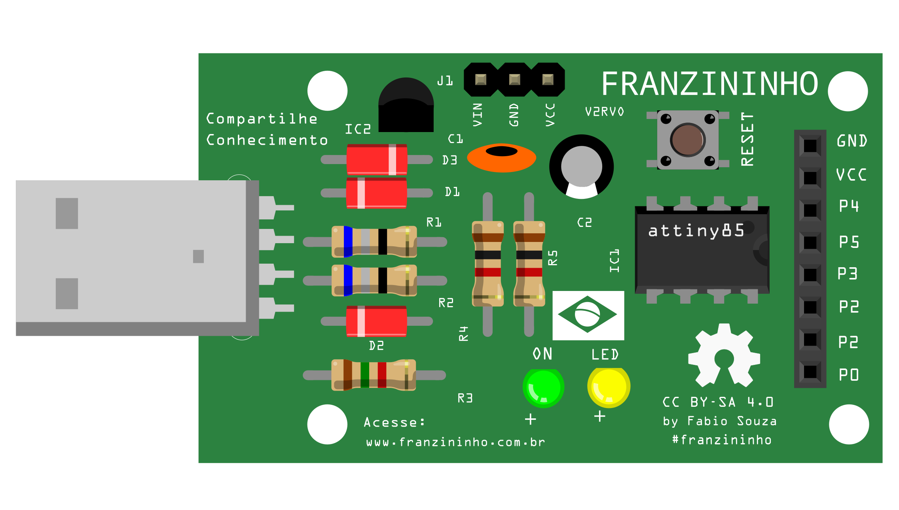

# Lista de Materiais para montar a Franzininho

### Versão da placa Franzininho V1RV1

  

| Referência   | Descrição  |
|---|---|
| C1    | Capacitor Cerâmico 100 nF x 50 V     |
| C2    | Capacitor eletrolítico 10 uF x 35 V |
| D1    | Diodo Zener 3,6 V 0,5W |
| D2    | Diodo Zener 3,6 V 0,5W |
| D3    | Diodo  1N4148  |
| IC1   | Microcontrolador ATTINY85 - 20PU  |
| SQ1   | Soquete Para CI - 8 pinos  |
| JP3   | Barra de pinos estampada 15 mm 180° - 8 vias |
| LED   | Led 3mm Amarelo Difuso  |
| ON   | Led 3mm Verde Difuso |
| R1    | Resistor 68 R - 5% 1/4 W  |
| R2    | Resistor 68 R - 5% 1/4 W |
| R3    | Resistor 1K5 - 5% 1/4 W |
| R4    | Resistor 1K - 5% 1/4 W  |
| R5    | Resistor 1K - 5% 1/4 W  |
|RESET  | Chave Táctil 6x6x5 mm |                
|PCB   | Placa de circuito impresso Franzininho RV1  |  

### Versão da placa Franzininho V2RV0

| Referência   | Descrição  |
|---|---|
| C1    | Capacitor Cerâmico 100 nF x 50 V     |
| C2    | Capacitor eletrolítico 10 uF x 35 V |
| D1    | Diodo Zener 3,6 V 0,5W |
| D2    | Diodo Zener 3,6 V 0,5W |
| D3    | Diodo  1N4148  |
| IC1   | Microcontrolador ATTINY85 - 20PU  |
| IC2   | 78L05 - Regulador de tensão |
| SQ1   | Soquete Para CI - 8 pinos  |
| JP3   | Barra de pinos estampada 15 mm 180° - 8 vias |
| J1    | Barra de pinos estampada 15 mm 180° - 3 vias  |
| LED   | Led 3mm Amarelo Difuso  |
| ON   | Led 3mm Verde Difuso |
| R1    | Resistor 68 R - 5% 1/4 W  |
| R2    | Resistor 68 R - 5% 1/4 W |
| R3    | Resistor 1K5 - 5% 1/4 W |
| R4    | Resistor 1K - 5% 1/4 W  |
| R5    | Resistor 1K - 5% 1/4 W  |
| RESET | Chave Táctil 6x6x5 mm |      
| USB   | Conector USB Macho 90º com trava |
|PCB   | Placa de circuito impresso Franzininho V2  |
