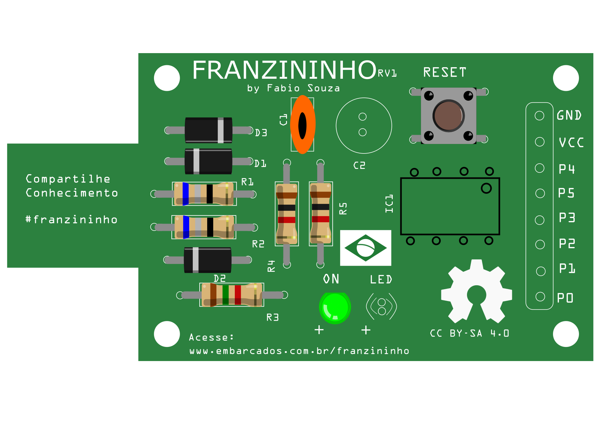

# Montagem da placa Franzininho versão 1

Antes de tudo você deve preparar o ambiente, separando as ferramentas necessárias para a soldagem, vamos precisar de:

- Ferro de solda
- Rolo de estanho
- Alicate de corte etc. 

Você também deve separar os componentes para deixar organizado, para  que facilite na hora de soldar. Você encontra os componentes na lista de materiais. Tudo organizados, então vamos lá?!

De início você terá uma placa sem componentes, conforme a imagem abaixo:

  
 
 
 **1. Diodo 1N1448**
 
 Iremos colocar o Diodo 1N4148 na referência D3
 
  
 
 **2. Diodo Zener**
  
  D1 deve-se colocar o primeiro diodo zener
 
  
  
  **3. Diodo Zener**
 
  D2 deve-se colocar o segundo diodo zener
  
   
   
   
 **4. Resistor 68R**
 
 O primeiro resistor iremos colocar no R1 suas cores são (Azul,cinza,preto,dourado)
 
   
 
 **5. Resistor 68R**
 
 O segundo resistor deve-se colocar no R1 suas cores são (Azul,cinza,preto,dourado)
 
  
 
 
  **6. Resistor 1K5**
  
 R3 deve-se colocar o resistor 1k5 que é representado nas cores (Marron,verde,vermelho,dourado)
  
    
  
 **7. Resistores 1K**
 
 Resistor 1K que é representado nas cores (Marron, preto, vermelho,dourado) deve-se colocar no R4 
 
    
 
 **8. Resistores 1K**
 
 Resistor 1K que é representado nas cores (Marron, preto, vermelho,dourado) deve-se colocar no R5 
 
    
 
  **9. Chave tactil**
 
 A chave você consegue colocar em apenas uma posição, então é só encaixa-la.
   
    
   
 **10. Soquete 8 pinos**
 
 O soquete deve ser colocado no IC1 que tras a facilidade do encaixe do Attiny85
 
   
  
  **11. Capacitor Cerâmico**
  
  No C1 você irá colocar o capacitor cerâmico.
  
  
  
  **12. LED Verde**
  
  O Led verde deve ser colocado no ON
  
  
  
  **13. LED Amarelo**
 
   
   
  **14. Capacitor eletrolitico**
  
  C2 vamos colocar o capacitor eletrolitico
  
   
   
  **15. Barra de 8 pinos**
 
  Referente ao (GNG, VCC, P6 ...P1,P0)
 
  
  
  
  **16. Attiny85**
  
  Por último iremos colocar o microcontrolador Attiny85
  
  
  
  
  Pronto! 
  
  
  Sua franzininho versão 1 está montada, agora é só programar e criar vários projetos.
  
   
   
   
   
   
   
   
 
 
 
