 
# Montagem da placa Franzininho versão 2

Antes de tudo você deve preparar o ambiente, separando as ferramentas necessárias para a soldagem, vamos precisar de:

- Ferro de solda
- Rolo de estanho
- Alicate de corte etc. 

Você também deve separar os componentes para deixar organizado, para  que facilite na hora de soldar. Você encontra os componentes na lista de materiais. Tudo organizados, então vamos lá?!

De início você terá uma placa sem componentes, conforme a imagem abaixo:

 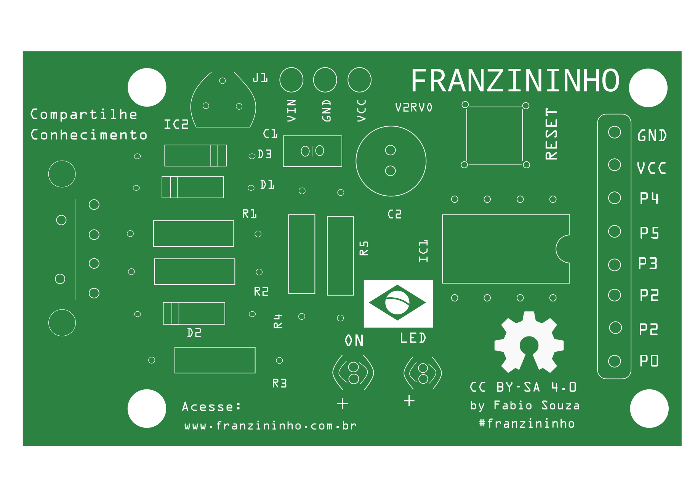 
 
 
 Você deve sempre começar pelos componentes baixos, você pode seguir conforme o modelo abaixo:
 
**1. Diodo 1N1448**

Primeiro componente a ser colocado é o Diodo 1N4148 no D3, cuidando com a polaridade dele, você vai entender que a faixa preta do diodo deve ser colocado conforme o desenho da placa.
 
  
 
 **2. Diodos Zener**
 
  Temos dois diodos zener, onde deverá ser colocado no D1 e D2 lembre-se da polaridade dele, coloque do lado certo!
 
  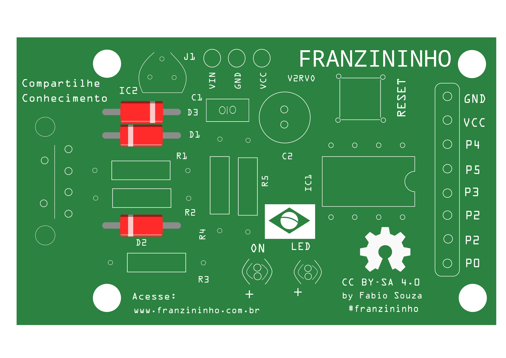 
  
  **3. Resistores 68R**
  
  No R1 e R2 você irá colocar o resistor 68R que é representado pelas cores (Azul,cinza,preto,dourado)
  
  
   
  
  
  **4. Resistor 1K5**
  
 R3 deve-se colocar o resistor 1k5 que é representado nas cores (Marron,verde,vermelho,dourado)
  
   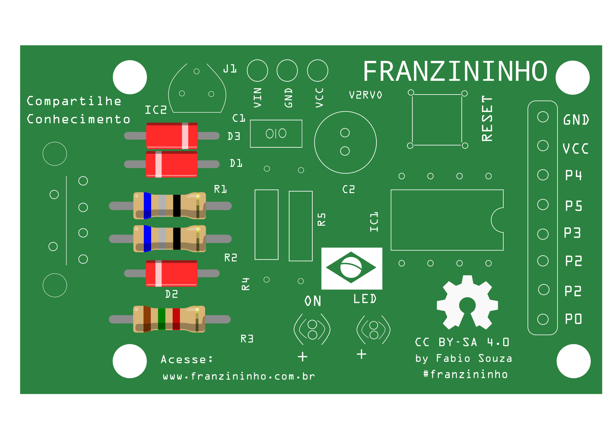 
  
 **5. Resistores 1K**
 
 Resistores 1K  que são representados nas cores (Marron, preto, vermelho,dourado) deve-se colocar no R4 e R5.
 
   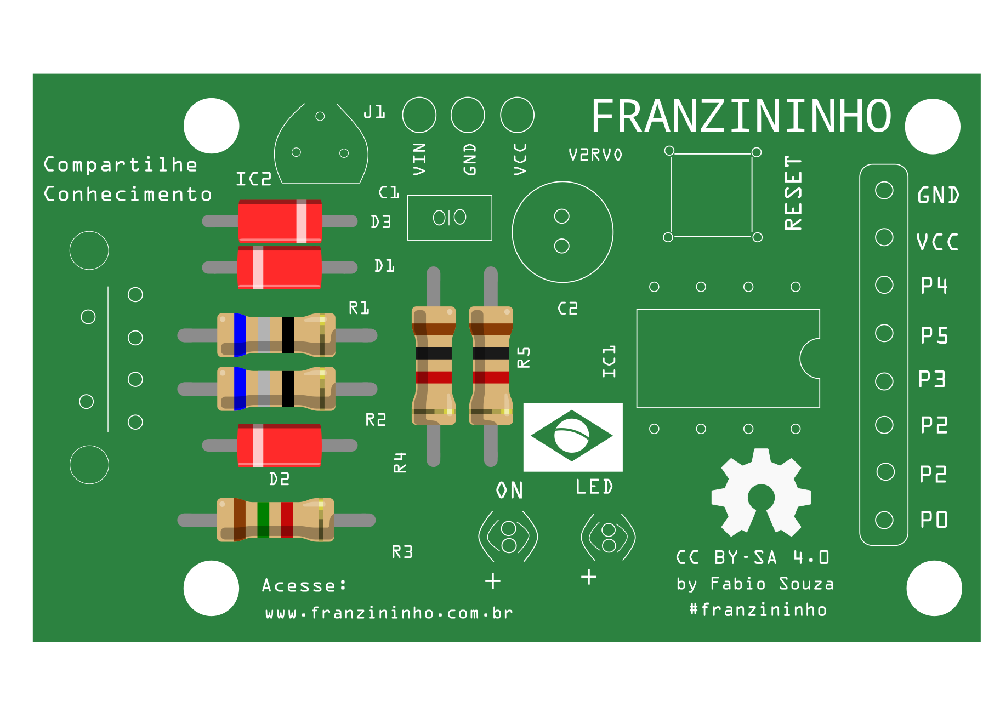 
   
 **6. Chave tactil**
 
 A chave você consegue colocar apenas uma posição, então é só encaixa-la
   
    
   
 **7. Soquete 8 pinos**
 
 O soquete deve ser colocado no IC1 que tras a facilidade do encaixe do Attiny85
 
  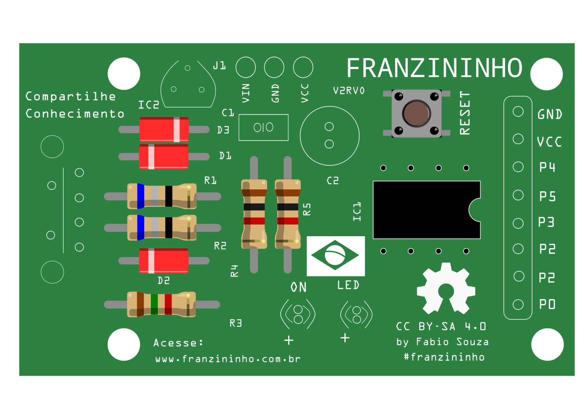 
  
  **8. Capacitor Cerâmico**
  
  No C1 você irá colocar o capacitor cerâmico.
  
  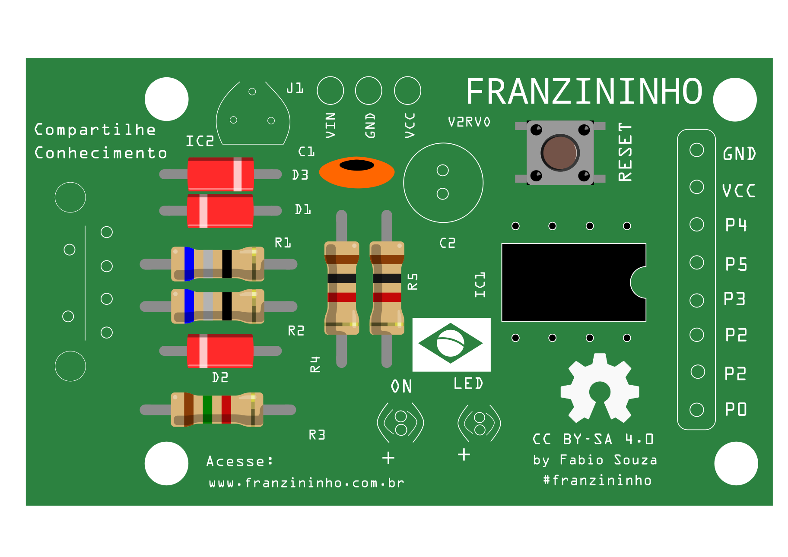
  
  **9. LED Verde**
  
  O Led verde deve ser colocado no ON
  
  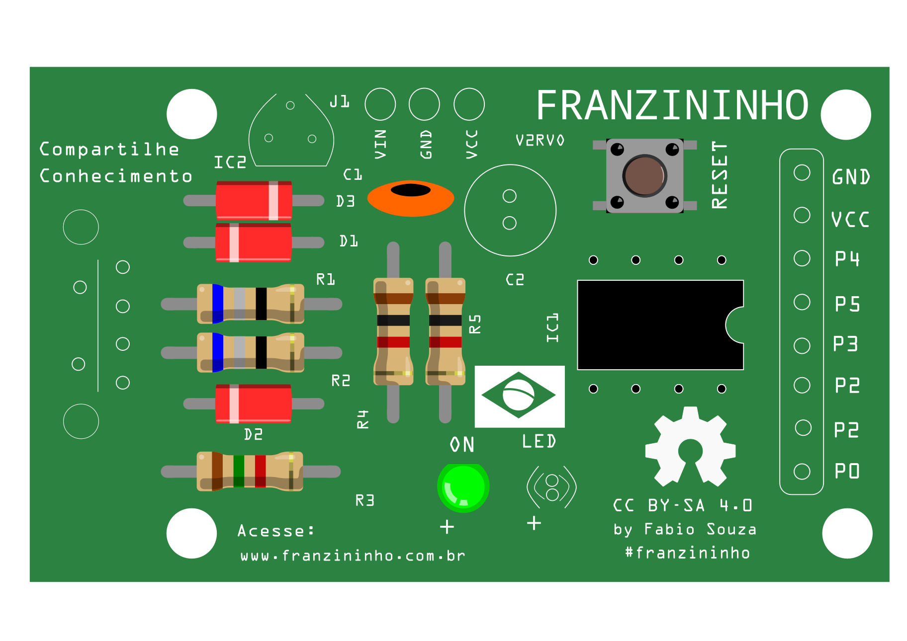
  
   **10. LED Amarelo**
  
  O Led amarelo deve ser colocado no LED
  
  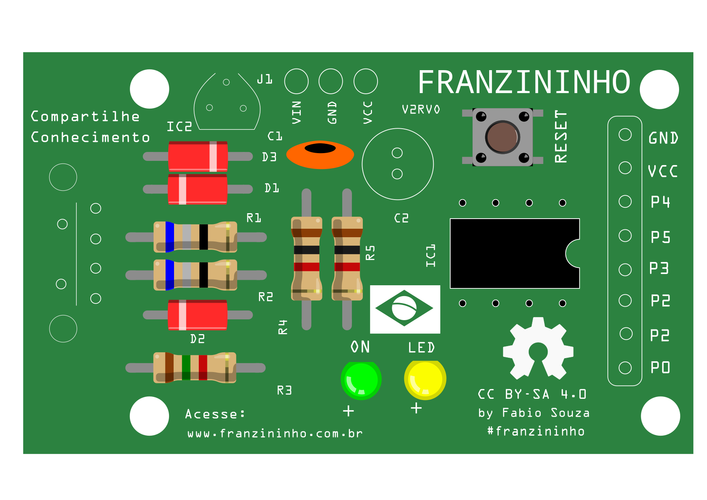
  
  
  **11. Transistor**
  
  No IC2 deve colocar o transistor, ele tem 3 terminais (perninhas) você deve colocar conforme o desenho na placa.
  
  
  
  
  **12. Capacitor eletrolitico**
  
  C2 vamos colocar o capacitor eletrolitico
  
  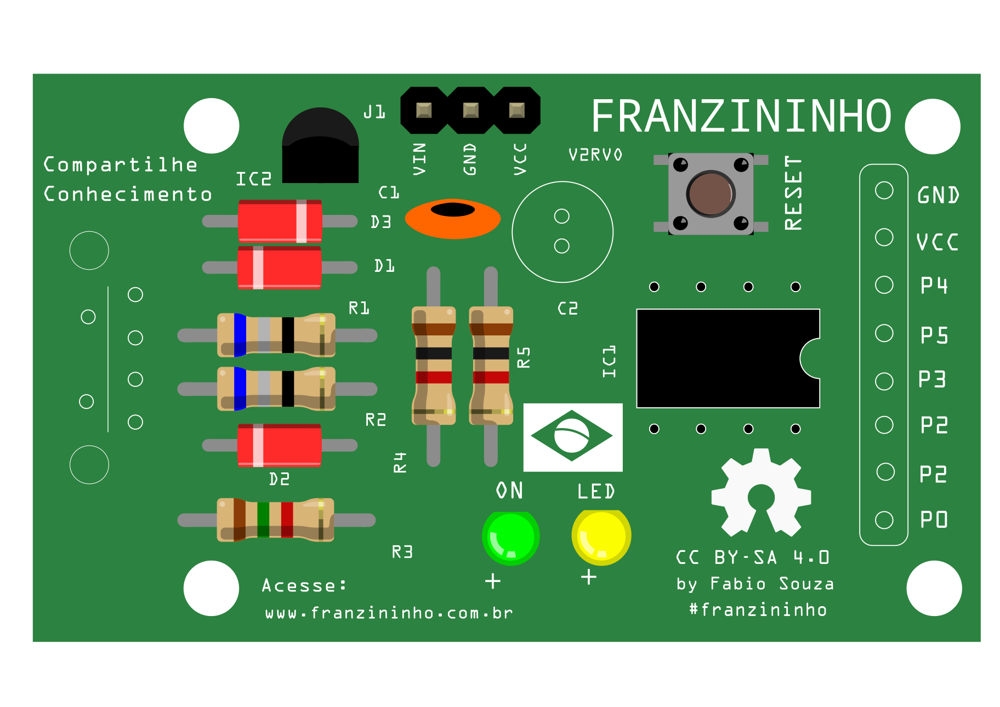
  
  **13. Barra de 3 pinos**
  
  J1 aonde está referenciado com VIN, GND, VCC você irá colocar a barra com três pinos
  
  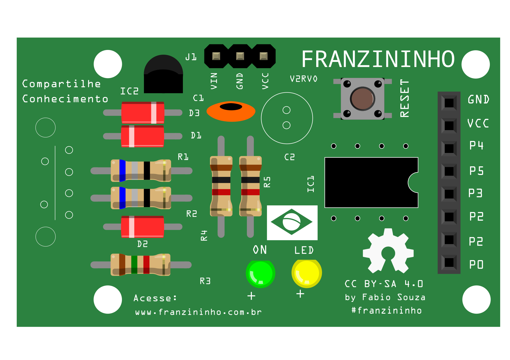
  
  **14. Barra de 8 pinos**
 
  Referente ao (GNG, VCC, P6 ...P1,P0)
 
  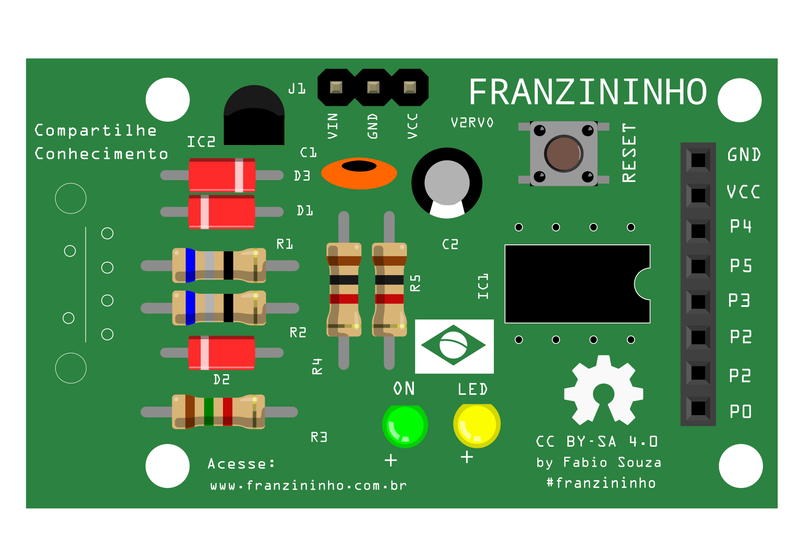
  
  **15. Conector USB**
   
   Por penúltimo iremos colocar o concetor USB, conforme o encaixe dele.
    
  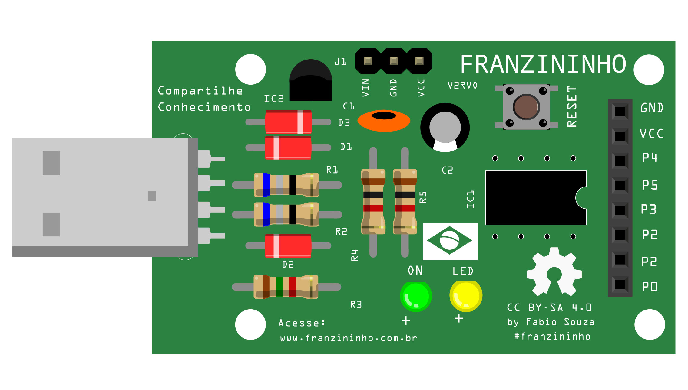
  
  **16. Attiny85**
  
  Por último iremos colocar o microcontrolador Attiny85
  
  
  
  
  Pronto! 
  
  
  Sua franzininho versão 2 está montada, agora é só programar e criar vários projetos.
  
  
  
  
  
  
  
  
  
  
  
  
  
  
  
  

   
   
  
