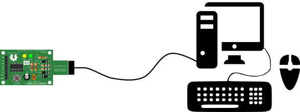
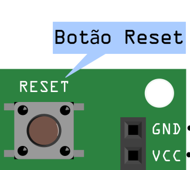
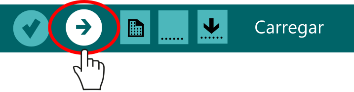
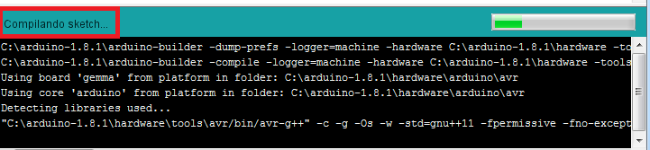
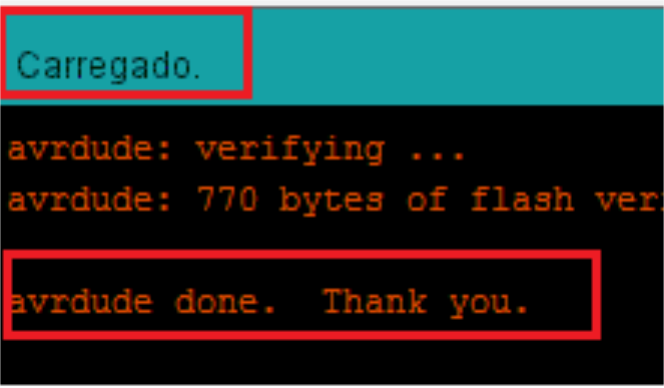
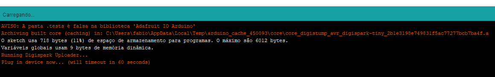
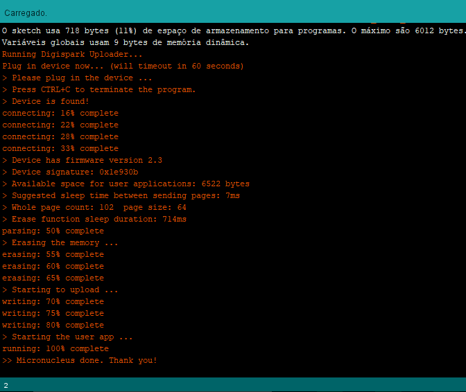

## Upload do sketch

Dependendo do bootloader gravado na placa, há duas formas de fazer upload do sketch:

## Arduino Gemma

Para fazer o upload para a Franzininho é necessário seguir os passos abaixo:

1 - Certifique que a placa está conectada ao computador:

2 - Pressione o botão de Reset:

3 - Imediatamente em seguida clique no botão de upload na IDE:

4 - É iniciada a programação:

5 - Após alguns instantes a sua Franzininho estará programada:

Maravilha, sua Franzininho foi programada.

## Micronucleus - Disgispark

O processo de gravação para o Micronucleus é um pouco diferente.

1 - Certifique que a placa está conectada ao computador:

2 - Clique no botão de upload na IDE:

 3 - Após a compilação será exibidada seguinte mensagem:

Você tem até 60 segundos para inserir a placa na USB do computador.

4 - Plugue a Franzininho na porta USB do seu computador

 Após plugar a placa será iniciado o upload do código:

Pronto, a sua Franzininho está programada.
