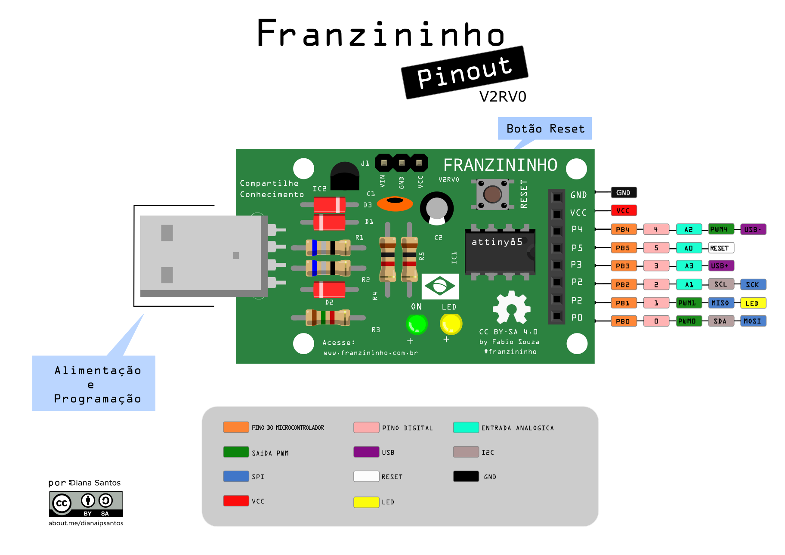
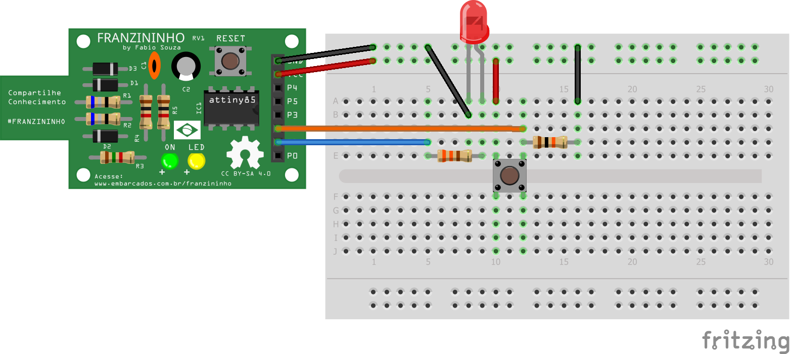

## Entradas e Saídas Digitais

Na Franzininho temos **6 pinos** que podem ser usados com entradas ou saídas digitais( P0 a P5), conforme pinout:



>**verificar limitações de uso dos pinos**

### Configuração do modo de funcionamento do pino

Os pinos do ATtiny85 podem ser configurados como entradas ou saídas, além de outras funções. Para configuração com entrada ou saída vamos usar a seguinte função:

`pinMode()`

Configura um pino especifico para ser entrada ou saída digital.

#### Sintaxe:
`pinMode(pino, modo);`

#### Parâmetros:

**pino:** corresponde ao pino que você irá usar,  no caso da Franzininho podemos usar pinos de 0 a 5.

**modo:** deve-se colocar o modo que deseja configurar o pino:
- INPUT  =  Entrada onde ele fica aguardando um sinal
- OUTPUT = Saída onde aparece um sinal do pino para ativar um circuito externo
- INPUT_PULLUP = Entrada digital com resistor de pull-up (ligado ao VCC) interno habilitado;


#### Exemplo

Vamos configurar pino P0 para leitura de uma tecla, portanto será uma entrada digital. Também vamos configurar o pino P1 para acionamento do LED, ou seja, uma saída digital:

```cpp
int tecla = 0;   //pino da tecla
int LED = 1;     //pino do LED

void  setup () {
 	pinMode(tecla, INPUT); //configura pino da tecla como entrada
	pinMode(LED, OUTPUT); //configura pino do LED como saída
}

void loop(){


}
```

Geralmente as configurações são realizadas dentro da função setup(). Na função loop são realizadas as tarefas durante o funcionamento da placa, como veremos mais a frente.


### Escrita em um pino digital

Os pinos digitais configurados como saídas digitais podem assumir dois valores, conforme a escrita no código. Os valores podem ser HIGH ou LOW, que se traduzem em 5V ou 0V no pino da Franzininho. Para escrita digital vamos usar a seguinte função:

`digitalWrite()`

Coloca um nível lógico Alto (HIGH, 5V) ou baixo (LOW, 0V) em um pino configurado como saída digital.


#### Sintaxe

`digitalWrite(pino, valor)`

#### Parâmetros

**pino:** Numero correspondente ao pino;

**valor:** HIGH OU LOW


#### Exemplo

Inverte o estado do LED (P1) em intervalos de 1 segundo:

```cpp
const int LED = 1; //pino digital conectado ao LED

void setup(){
  pinMode(LED,OUTPUT); //pino digital de saída
}

void loop(){
  digitalWrite(LED,HIGH);   //acende o led da placa
  delay(1000);             //aguarda um segundo
  digitalWrite(LED,LOW);  //apaga o led da placa
  delay(1000);           //aguarda um segundo
}
```

A funçao delay(ms) espera um tempo em milisegundos. No caso do exemplo acima, 1000 ms = 1 segundo;


### Leitura de um pino digital

Um pino digital pode assumir dois valores, HIGH e LOW, conforme o nível de tensão presente no mesmo: 5V ou 0V. Podemos usar o pino configurado como entrada digital para ler estados de sensores, que por sua vez representam estados de situações, por exemplo:
- botão solto ou pressionado;
- porta aberta ou fechada
- presença de objeto ou não presença de objeto

Para leitura de uma entrada digital usamos a seguinte função:

`digitalRead()`

Lê o valor presente e um pino digital. Este valor pode ser HIGH ou LOW.

#### Sintaxe

`digitalRead(pino);`

#### Parâmetros:

**pino:** valor correspondente ao pino que se deseja ler.


#### Retorno

HIGH ou LOW.


#### Exemplo

Vamos ler o estado da tecla ligada o pino P2 e acionar o LED ligado a pino P1 conforme o seu estado:



```cpp
const int LED = 1; //pino para o LED
const int BOTAO = 2; //pino para o botão

int val = 0; // val será utilizado para armazenar o estado do pino

void setup(){
  pinMode(LED,OUTPUT); //o LED é uma saída
  pinMode(BOTAO,INPUT); //o BOTAO é uma entrada
}

void loop (){
val = digitalRead(BOTAO); // lê e armazena o valor de entrada
digitalWrite(LED, val); //aciona LED conforme valor lido do botão

}
```  
