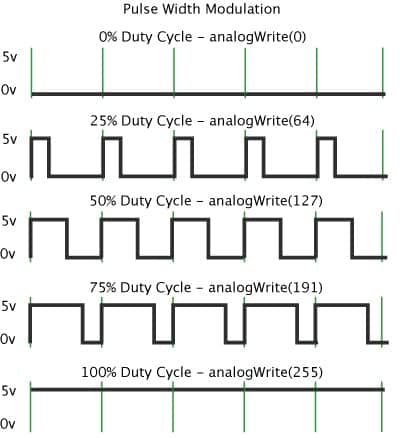
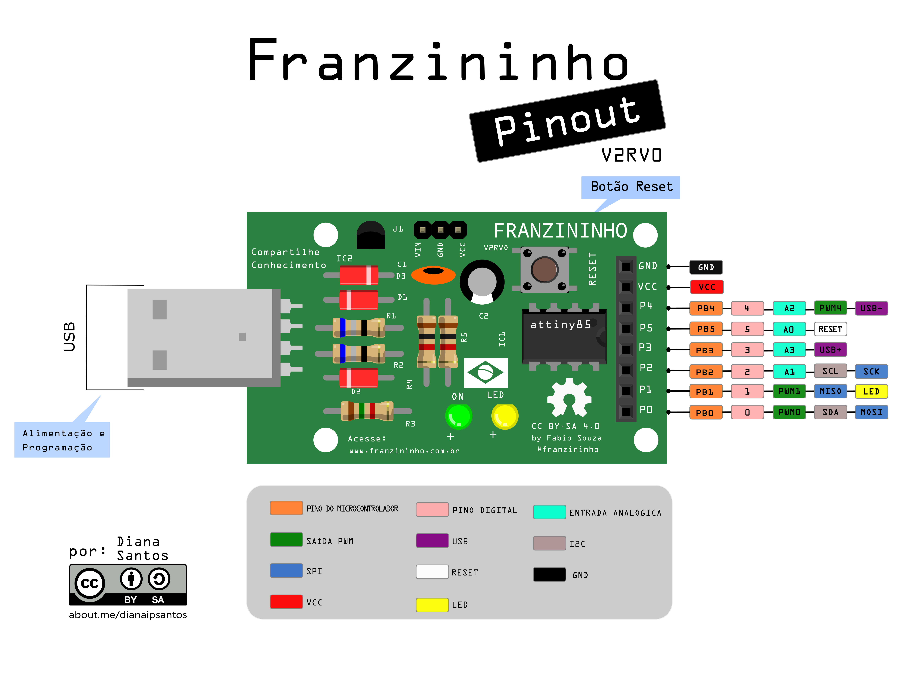
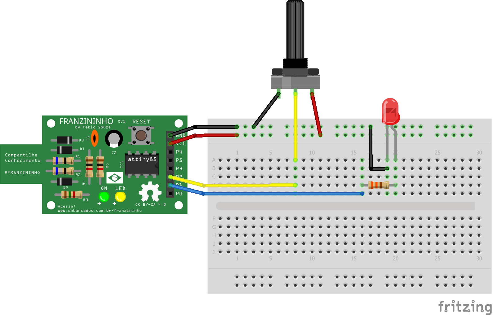

## O que é PWM?


PWM, do inglês Pulse Width Modulation, é uma técnica utilizada por sistemas digitais para variação do valor médio de uma forma de onda periódica. A técnica consiste em manter a frequência de uma onda quadrada fixa e variar o tempo que o sinal fica em nível lógico alto. Esse tempo é chamado de duty cycle, ou seja, o ciclo ativo da forma de onda. No gráfico abaixo são exibidas algumas modulações PWM:



Analisando as formas de onda nota-se que a frequência da forma de onda tem o mesmo valor e varia-se o duty cycle da forma de onda. Quando o duty cicle está em 0% o valor médio da saída encontra-se em 0 V e consequentemente para um duty cycle de 100% a saída assume seu valor máximo, que no caso é 5V. Para um duty cycle de 50% a saída assumirá 50% do valor da tensão, 2,5 V e assim sucessivamente para cada variação no duty cycle. Portanto, para calcular o valor médio da tensão de saída de um sinal PWM pode-se utilizar a seguinte equação:


Vout = (duty cycle/100)* Vcc


Onde:

- Vout - tensão de saída em V;
- duty cycle - valor do ciclo ativo do PWM em %;
- Vcc - tensão de alimentação em V.


PWM pode ser usada para diversas aplicações, como por exemplo:

- controle de velocidade de motores;
- variação da luminosidade de leds;
- geração de sinais analógicos;
- geração de sinais de áudio.

Fonte: [Usando as saídas PWM do Arduino](https://www.embarcados.com.br/pwm-do-arduino/)

Na Franzininho temos **3 pinos** que pode ser usado como saidas PWM(PWM0,PWM1 e PWM4) conforme pinout:



>**verificar limitações de uso dos pinos**


## Função

A função analogWrite() escreve um valor de PWM em um pino digital que possui a função PWM. Para usar o pino como saída PWM é necessário configurá-lo como saída digital.


#### Sintaxe:
`analogWrite(pino, valor);`

#### Parâmetros:
- pino corresponde ao pino que será gerado o sinal PWM (0,1,4 na Franzininho);
- valor corresponde ao duty cycle, ou seja, o valor que permanecerá em nível alto o sinal.

O valor deve ser de 0 a 255 onde com  0 a saída permanece sempre em nível baixo e 255 a saída permanece sempre em nível alto.


#### Exemplo

Vamos controlar o brilho do LED conforme o valor lido no potenciômetro




```cpp
const byte LED = 1; //pino do LED
const byte POT = A1; //pino do Potenciômetro

void setup() {
  pinMode(LED,OUTPUT);
}

void loop() {

  int valor = analogRead(POT); // lê o valor do potenciômetro
  analogWrite(LED,valor/4);    //escreve no LED valor entre 0 e 255

}
```  
