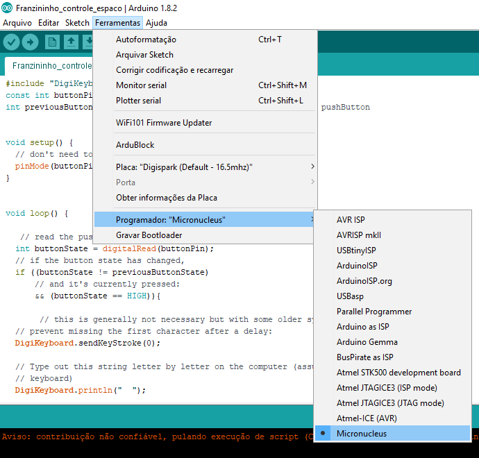

## Controle Jogo Google Chrome (dinossauro)

Nesse tutorial vamos exibir como controlar o jogo do Google Chrome (quando a internet cai :( ) usando a Franzininho.

Para esse tutorial você precisa instalar o bootloader Micronucleus, conforme exibido nesse tutorial.


### Circuito

Para esse projeto você irá precisar apenas de uma Franzininho e uma chave tactil:

imagem circuito


### Configuração da IDE Arduino

Vamos usar os exemplos da Digispark para USB. Para isso, você precisa instalar o pacote de suporte da Digispark.

Acesse o menu Arquivos->preferencias e cole a URL a seguir para gerenciador de placas:

    http://digistump.com/package_digistump_index.json

 

Agora acesso o menu: Ferramentas-> placa -> Gerenciador de placas. Aguarde alguns segundos até atualização da lista de pacotes e digite "digi". Aparecerá o pacote “Digistump AVR Boards” e clique em instalar.

 

Aguarde o fim da instalação e clique em fechar.

Agora acesse o menu: Ferramentas->placas e escolha a opção “Digispark (Default - 16.5mhz)”.

 

Agora acesse o menu Ferramentas-> programador e selecione a opção Micronucleus:

 

Pronto a IDE está pronta para programar a placa.


## Sketch

Para o funciomento da Franzininho como controle do jogo do Google Chrome (dinossauro), você precisa carregar o seguinte sketch:

```c++
#include "DigiKeyboard.h"         //biblioteca da digispark para teclado

const int btPin = 2;          //pino que a tecla esta ligada

int estadoAnteriorBotao = 0;   // armazena o estado anterior do botão


void setup() {
  pinMode(btPin,INPUT_PULLUP);    //configura o pino do botão como entrada com pullup habilitado
}


void loop() { 
   
  int estadoAtualBT= digitalRead(btPin);      // Lê estado do botão
  
  
  if ((estadoAtualBT != estadoAnteriorBotao)&& (estadoAtualBT == LOW)){       //Se o botão foi pressionado e o seu estado mudou 

  //Envia comando da tecla espaço para o computador

  DigiKeyboard.sendKeyStroke(0);
  DigiKeyboard.println("  ");
        
  }
  
  estadoAnteriorBotao = estadoAtualBT;  //salva o estado do botão para comparar na próxima leitura
  
}
```
    

Pronto, agora é só se divertir.


## Desafio

Você percebeu que o jogo precisa de mais um comando para o dinossauro baixar? Insira esse comando incluindo uma nova tecla.

## Crie novos projetos

O exemplo apresentado pode ser adaptado para controle de outros jogos que usam teclas como controle. Verifique quais jogos você pode controlar e insira mais teclas.

Boa diversão


