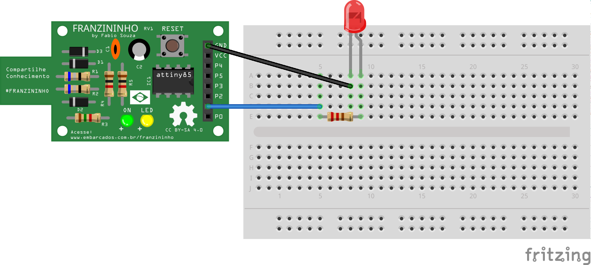

## Exemplo - Controle brilho de LED


Nesse exemplo é feito o controle do brilho do LED gradualmente. Para esse exemplo vamos usar a função analogWrite, que aciona a saída com PWM.


### Materiais
- Placa Franzininho;
- Protoboard;
- LED 3mm;
- Resistor 220;
- Jumpers macho/fêmea;

### Circuito

Na protoboard você pode montar o circuito para acionamento do LED da seguinte forma:




### Sketch

```c++
/*
  Franzininho
  Exemplo: Controle Brilho de LED - PWM

  Esse exemplo exibe como controlar a intensidade de brilho de um LED usando PWM
*/

const int LED = 1; //pino para o LED
int i = 0;        //utilizaremos essa variável para contagem auxiliar

void setup() {
 pinMode(LED,OUTPUT); //configura o pino do LED como uma saída
}

void loop() {
  //faz um loop de 0 a 255 (acende gradualmente)
  for (i = 0; i<255; i++) {
    analogWrite (LED, i);  // define o brilho do LED
    delay (10); //espere 10ms, pois analogwrite é um instantâneo e não veríamos nenhuma alteração
  }

  //faz um loop de 255 a 1 (apaga gradualmente)

  for (i = 255; i > 0; i--) {  
   analogWrite(LED, i); //define o brilho do LED
   delay(10);          //aguarda 10ms
  }
}


```
