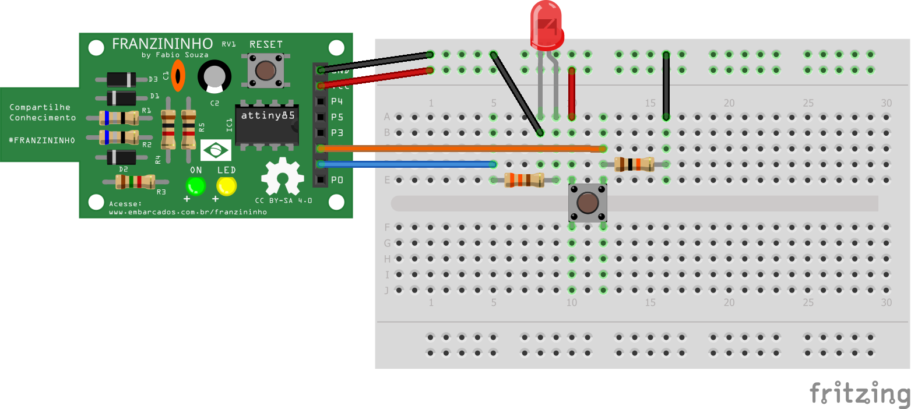

## Exemplo - Leitura de Tecla

Nesse exemplo vamos fazer a leitura de uma tecla e acionar um LED quando a mesma for pressionada.


### Materiais

Placa Franzininho;
Protoboard;
LED 3mm;
1 Resistor 220;
1 Resistor de 1K
1 Botão
Jumpers macho/fêmea;


### Circuito


No protoboard você deve inserir o LED, resistores e o botão, conforme a imagem abaixo:





Sketch

```c++
/*
  Franzininho
  Exemplo: Leitura de Tecla - Pull Down

  Esse exemplo exibe como ler uma tecla com resistor de pull down e acionar um led quando ela for pressionada

*/

const int LED = 1; //pino para o LED
const int BOTAO = 2; //pino para o botão

int val = 0; // val será utilizado para armazenar o estado do pino

void setup(){
  pinMode(LED,OUTPUT); //o LED é uma saída
  pinMode(BOTAO,INPUT); //o BOTAO é uma entrada
}

void loop (){
val = digitalRead(BOTAO); // lê e armazena o valor de entrada
digitalWrite(LED, val); //aciona LED conforme valor lido do botão

}

```
