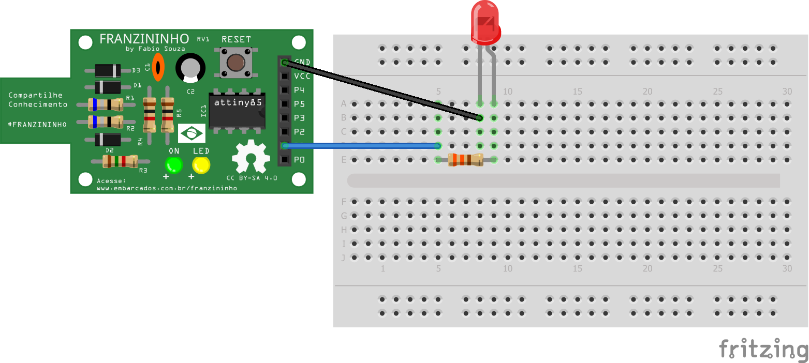

## Exemplo - Pisca LED - Blink

O primeiro contato com a programação com o Arduino,  você faz o blink (que faz  com que o led pisque em intervalos de tempo). Com a Franzininho não é diferente, você pode testar com o próprio LED que ela tem ou caso você queira, pode ligar um LED em uma protoboard. A seguir vamos explicar como fazer um blink com a Franzininho.


### Materiais:

- Placa Franzininho;
- Protoboard;
- LED 3mm;
- Resistor 330;
- Jumpers


### Circuito

Na protoboard você pode montar o circuito para acionamento do LED da seguinte forma:




### Sketch

````c++
/*
  Pisca LED - Blink

  Esse exemplo exibe como piscar o LED presente na placa ou um LED externo ligado ao pino 1 da Franzininho em intervalos de 1 segundo.

*/

const int LED = 1; //pino digital conectado ao LED

void setup(){
  pinMode(LED,OUTPUT); //pino digital de saída
}

void loop(){
  digitalWrite(LED,HIGH);   //acende o led da placa
  delay(1000);             //aguarda um segundo
  digitalWrite(LED,LOW);  //apaga o led da placa
  delay(1000);           //aguarda um segundo
}

````
