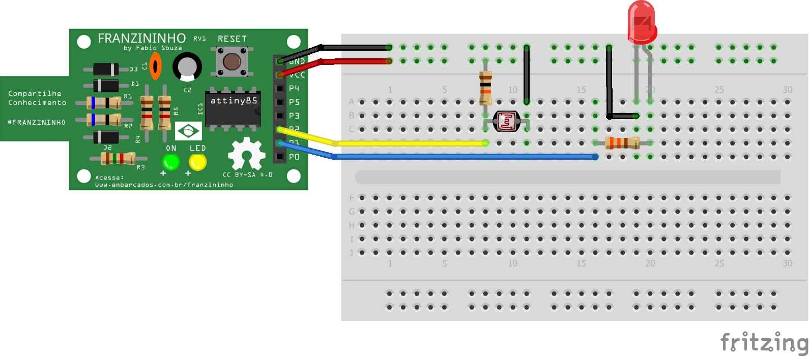

## Exemplo - Sensor de luz com LDR

Nesse exemplo vamos ler um sensor LDR usando a entrada analógica. Será exibido um exemplo de funcionamento de uma fotocélula, onde ao escurecer será aceso o LED, como acontece na luz da rua. ;)


### Materiais

- Placa Franzininho;
- Protoboard;
- 1 Resistor 10K;
- 1 LDR(10K)
- Jumpers


### Circuito


Faça a seguinte ligação no protoboard:





Sketch

```c++
/*
  Franzininho
  Exemplo: Sensor de Luz - LDR

 Nesse exemplo vamos ler um sensor LDR usando a entrada analógica. Será exibido um exemplo de funcionamento de uma fotocélula, onde ao escurecer será aceso o LED, como acontece na luz da rua. ;)


*/


//Sensor de luz com LDR

int ledPin = 1; //Led no pino 1 - LED da placa
int ldrPin = A1; //LDR no pino analógico A1
int ldrValor = 0; //Valor lido do LDR

void setup() {
 pinMode(ledPin,OUTPUT); //define LED como Saída
}

void loop() {
 //ler o valor do LDR
 ldrValor = analogRead(ldrPin); //O valor lido será entre 0 e 1023

 //se o valor lido for maior que 800, liga o led
 if (ldrValor>= 800){
   digitalWrite(ledPin, HIGH);      //aciona saída
 } else {  // senão, apaga o led            
   digitalWrite(ledPin,LOW);        //desliga saída
 }

 delay(100);
}


```
